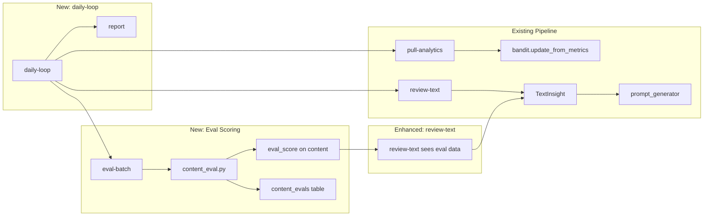
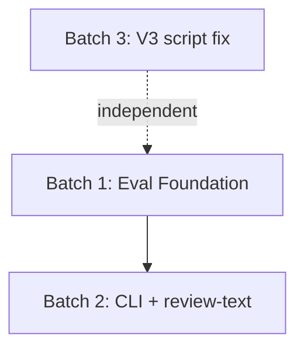

# Autoresearch Eval Loop for V3 and Image Motion

## Architecture




## Batch 1: Eval Foundation (models, DB, eval module)

**Goal**: Define the eval data model, add storage, create the scoring module. 3 files: `src/models.py`, `src/db.py`, `db/schema.sql`, and 1 new file `src/content_eval.py`.

### 1a. Data model -- [src/models.py](src/models.py)

Add two new dataclasses after `BanditObservation`:

```python
@dataclass
class ContentEval:
    id: Optional[int] = None
    content_id: str = ""
    criterion: str = ""       # e.g. "hook", "first_frame", "narrative_arc", etc.
    passed: bool = False
    evaluated_at: Optional[str] = None

EVAL_CRITERIA = [
    "hook",
    "first_frame",
    "narrative_arc",
    "specificity",
    "caption",
    "scene_progression",
]
```

Add `eval_score` field to the existing `Content` dataclass:

```python
# after strategy_metadata_json
eval_score: Optional[int] = None   # 0-6, set by content_eval
```

### 1b. Schema -- [db/schema.sql](db/schema.sql)

Add a new `content_evals` table after the `commerce_facts` block:

```sql
CREATE TABLE IF NOT EXISTS content_evals (
    id              INTEGER PRIMARY KEY AUTOINCREMENT,
    content_id      TEXT NOT NULL REFERENCES content(id),
    criterion       TEXT NOT NULL,
    passed          INTEGER NOT NULL DEFAULT 0,
    evaluated_at    TEXT DEFAULT (datetime('now')),
    UNIQUE (content_id, criterion)
);
CREATE INDEX IF NOT EXISTS idx_content_evals_content ON content_evals(content_id);
```

### 1c. DB helpers -- [src/db.py](src/db.py)

Add to `_run_migrations()` (around line 57) -- add `eval_score` column to content:

```python
("eval_score", "ALTER TABLE content ADD COLUMN eval_score INTEGER"),
```

Add 4 new functions:

- `insert_content_evals(content_id: str, evals: list[ContentEval]) -> None` -- bulk insert eval results with `INSERT OR REPLACE` on the unique constraint
- `update_content_eval_score(content_id: str, score: int) -> None` -- set `eval_score` on the content row
- `get_content_evals(content_id: str) -> list[ContentEval]` -- retrieve per-criterion results
- `list_unscored_content(lookback_days: int = 7) -> list[Content]` -- content with `eval_score IS NULL` created within lookback window

### 1d. Eval module -- new file `src/content_eval.py`

Structure follows `src/text_review.py` pattern:

- `EVAL_SYSTEM_PROMPT` -- instructs the LLM to read the creative payload and answer 6 yes/no questions
- `_build_eval_prompt(content: Content) -> str` -- extracts from `content.hook_text`, `content.problem_angle`, `content.asset_manifest_json` (parses JSON to get timeline/frames, voiceover, captions, strategy_metadata), and `content.starting_image_prompt`. Formats them into a structured prompt.
- `_parse_eval_response(raw: str) -> dict[str, bool]` -- parses 6 yes/no answers keyed by criterion name
- `score_content(content: Content) -> int` -- orchestrates: build prompt, call LLM, parse, store evals via `db.insert_content_evals()`, compute score (count of True), call `db.update_content_eval_score()`, return score
- `score_batch(lookback_days: int = 7) -> int` -- calls `db.list_unscored_content()`, scores each, returns count

**The 6 binary criteria** (embedded in `EVAL_SYSTEM_PROMPT`):

1. **HOOK**: Does the hook_text create a specific curiosity gap or name a specific frustration -- not just introduce the product?
2. **FIRST_FRAME**: Would the opening visual description produce a scroll-stopping thumbnail?
3. **NARRATIVE_ARC**: Does the full voiceover build a single coherent arc with a turning point -- not a list of benefits?
4. **SPECIFICITY**: Is the problem_angle specific enough that a viewer would think "that's exactly my situation"?
5. **CAPTION**: Does the Instagram caption read like something a real person would type?
6. **SCENE_PROGRESSION**: Does every scene/frame introduce a genuinely new idea that advances the story?

The prompt adapts per format:

- V3 (`ai_video_flex_15s`): reads `timeline[].script` + `timeline[].tone` + `starting_image_prompt` + `strategy_metadata.expression_arc`
- Image motion (`image_motion_15s`): reads `image_plan.frames[].frame_intent` + `voiceover_plan.voiceover_script` + `frames[0].image_prompt`

Config: uses existing `openai.api_key` and a new optional `eval.model` key (default: `gpt-4.1-mini` for cost efficiency). Add to [config.example.yaml](config.example.yaml):

```yaml
eval:
  model: "gpt-4.1-mini"
```

Cost tracking: insert a `Cost` row with `step="eval"` per scored content item.

---

## Batch 2: CLI Surface + review-text Integration

**Goal**: Add CLI commands, enhance review-text to include eval data, add daily-loop orchestration. 2 files: `cli.py`, `src/text_review.py`.

### 2a. CLI commands -- [cli.py](cli.py)

Add two new commands:

`**eval-content`**:

```
@cli.command("eval-content")
@click.option("--content-id", required=True)
@click.option("--row-scope", ...)
```

Resolves content, calls `content_eval.score_content()`, prints per-criterion pass/fail and total score.

`**eval-batch**`:

```
@cli.command("eval-batch")
@click.option("--lookback-days", default=7)
```

Calls `content_eval.score_batch()`, prints count of scored items.

`**daily-loop**`:

```
@cli.command("daily-loop")
@click.option("--lookback-days", default=7)
```

Chains in sequence:

1. `pull-analytics` logic (from existing `pull_analytics_cmd`)
2. `eval-batch` logic (score unscored content)
3. `review-text` logic (generate insight with eval data)
4. `report` logic (generate and display/email briefing)

Each step prints its result. If a step fails, log warning and continue to next step.

### 2b. Enhance review-text -- [src/text_review.py](src/text_review.py)

**Change 1**: `_format_row_lines()` (line 160) -- add `eval_score` to each row output.

The `list_recent_text_review_rows()` query in [src/db.py](src/db.py) (line 1155) already returns `content_id`. Use that to look up `eval_score` from the content table. The simplest approach: add `c.eval_score` to the SELECT at line 1199 in the existing query. Then in `_format_row_lines()`:

```python
f"eval {int(row.get('eval_score') or 0)}/6 | "
```

inserted after the `engagements` field.

**Change 2**: `_SYSTEM_PROMPT` (line 17) -- add one bullet:

```
- When eval_score is available (0-6 quality checklist), note whether high-scoring content
  also performs well. If high-eval content underperforms, flag which aspects of the checklist
  may not predict real engagement.
```

**Change 3**: `_build_analysis_prompt()` (line 92) -- add eval score distribution to the scope section:

```python
eval_scores = [int(row.get("eval_score") or 0) for row in rows if row.get("eval_score") is not None]
if eval_scores:
    lines.append(f"- eval_score_avg: {sum(eval_scores)/len(eval_scores):.1f}/6")
```

---

## Batch 3: V3 script:null Removal

**Goal**: Require every V3 scene to have a non-empty voiceover script. 2 files: `src/prompt_generator.py`, `tests/test_prompt_generator.py`.

### 3a. System prompt -- [src/prompt_generator.py](src/prompt_generator.py)

In `_AI_VIDEO_V3_SYSTEM_PROMPT` (line 897):

- **Line ~929** (PACING section): Replace the bullet about visual-only beats:
  - Remove: `"Not every scene needs voiceover. 1-2 scenes can be visual-only beats (music and visual) for breathing room. Mark these with script: null."`
  - Replace with: `"Every scene must include a narrator voiceover line. Write a short, natural line that fits the scene duration and advances the story. Do not use silent or visual-only beats."`
- **Line ~938** (SCENE RULES): Change "an optional script" to "a non-empty script"
- **Line ~986** (JSON schema): Change `"string or null"` to `"string -- required third-person narrator voiceover for this scene"`

### 3b. Validation -- [src/prompt_generator.py](src/prompt_generator.py)

In `_validate_and_normalize_v3_timeline()` (line 2050):

After extracting `script` from each scene, add a check that rejects null/empty:

```python
script = scene.get("script")
if not isinstance(script, str) or not script.strip():
    raise ValueError(f"V3 timeline[{i}] must have a non-empty script (no visual-only beats)")
scene["script"] = script.strip()
```

### 3c. Script collection -- [src/prompt_generator.py](src/prompt_generator.py)

In `_collect_timeline_scripts()` (line 436): Change from silently skipping non-string/blank scripts to raising an error for V3 usage. Since this function is also used by V2, the safest approach is to add a `strict: bool = False` parameter:

```python
def _collect_timeline_scripts(timeline: list[Any], strict: bool = False) -> list[str]:
```

When `strict=True`, raise on missing/blank scripts instead of skipping. Update the V3 caller in `_build_v3_voiceover_plan()` to pass `strict=True`.

### 3d. Voiceover plan -- [src/prompt_generator.py](src/prompt_generator.py)

In `_build_v3_voiceover_plan()` (line 450): Remove the `if not timeline_scripts: return None` fallback. With strict collection, this becomes an impossible state for valid V3 content. Replace with an assertion or error.

### 3e. Tests -- [tests/test_prompt_generator.py](tests/test_prompt_generator.py)

- **Replace** `test_generate_content_ai_video_flex_15s_v3_omits_voiceover_plan_when_scripts_are_empty` (line 2012) with a test asserting that blank/null scripts raise `ValueError` during V3 generation.
- **Keep** `test_build_v3_voiceover_plan_sanitizes_unicode` (line 1297) unchanged -- it uses non-empty scripts.
- **Keep** `test_generate_content_ai_video_flex_15s_persists_v3_voiceover_plan` (line 1862) unchanged.
- **Add** new test: `test_v3_timeline_rejects_null_script` -- validates that `_validate_and_normalize_v3_timeline` raises on `script: null`.
- **Add** new test: `test_v3_timeline_rejects_empty_script` -- validates raise on `script: ""`.

---

## Batch Sequencing




Batch 3 has no dependency on Batches 1-2 and can be done in parallel or in any order. Batch 2 depends on Batch 1 (needs the eval module and DB helpers).

## Files Changed Summary

- **New**: `src/content_eval.py`
- **Batch 1**: `src/models.py`, `src/db.py`, `db/schema.sql`, `config.example.yaml`
- **Batch 2**: `cli.py`, `src/text_review.py`
- **Batch 3**: `src/prompt_generator.py`, `tests/test_prompt_generator.py`
- **Tests** (Batches 1-2): `tests/test_content_eval.py` (new), `tests/test_text_review.py` (enhanced)

